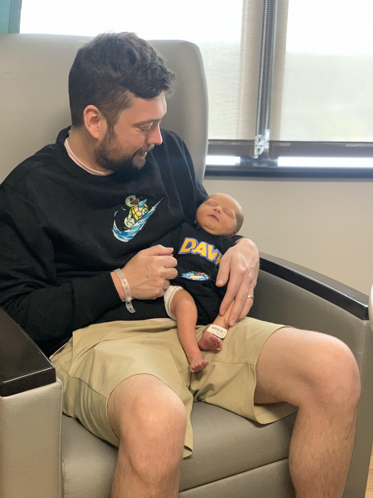

   
   
     
   

      I'm a software engineer with a passion for <em>cloud</em>, 
      <em>serverless</em>, 
      <em>infrastructure</em>, and 
      <em>developer experience</em>. 
      Currently, I work for <em>Goldman Sachs</em> as a Cloud Engineer, 
      helping teams migrate to the cloud and developing internal frameworks and reference stacks.
   

    
   
Right now my main <b><em>interests</em></b> are in , , and everyone's favorite, .
   

   
   

   
Feel free to reach out to me via email at <a href="mailto:me@davedennis.dev" style="color: #6A0DAD;"><em>me@davedennis.dev</em></a> or visit my personal website at <a href="https://davedennis.dev" style="color: #6A0DAD;"><em>davedennis.dev</em></a>. Or any of these, whatever floats your boat.

   
   
   
   

